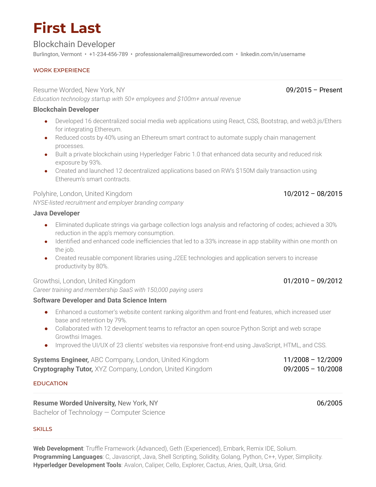
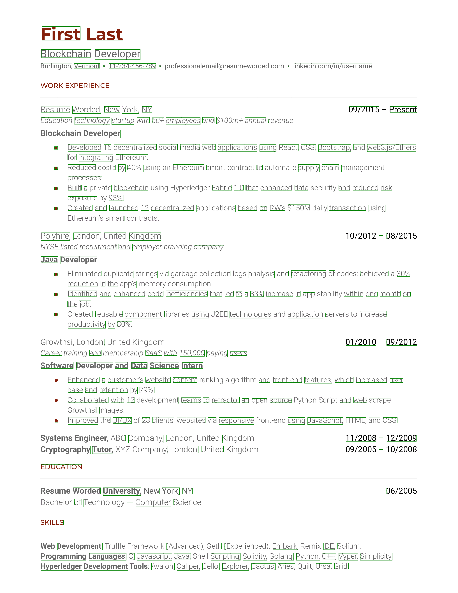
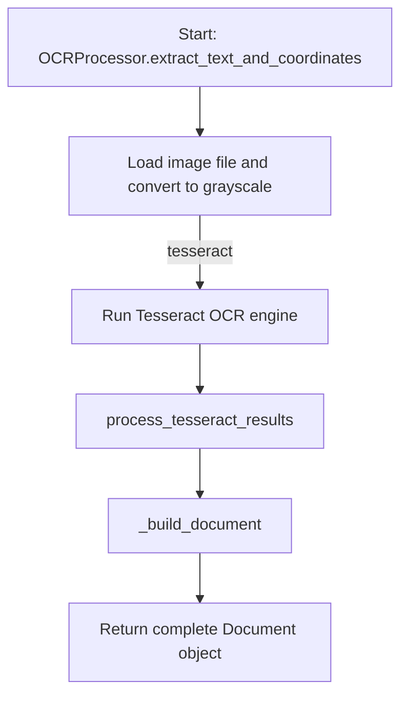
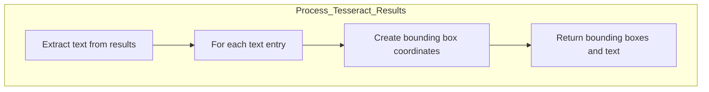
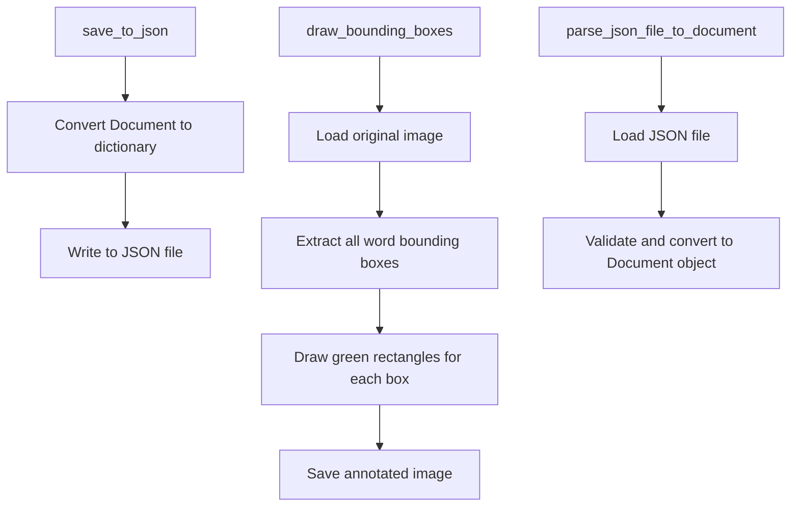

# Image Processor Utility

This utility provides a comprehensive workflow to process images files, including extracting text, saving data in JSON format, drawing bounding boxes, and performing advanced text searches.

## Features

- **Extract Text and Coordinates**: Extract text from image files along with bounding box coordinates.
- **Save to JSON**: Save extracted data as JSON files for easy analysis.
- **Draw Bounding Boxes**: Overlay bounding boxes on PDF pages based on extracted coordinates.
- **Parse JSON to Document**: Load JSON data back into a structured Document object.

## Example input and output
### Input

### Output


## Flowchart
#### `OCRProcessor.extract_text_and_coordinates()`


#### `Process Rapid or Tesseract Results`



#### `Building Document, Page, Line, Word`

```mermaid
flowchart TD
    subgraph Document_Building
        H1[Sort words by y-coordinate] --> H2[_build_page for each page]
        H2 --> H3[Return Document object]
    end

    subgraph Page_Building
        H2A[_build_page] --> H2B[Group words into lines by vertical position]
        H2B --> H2C[Sort words by x-coordinate]
        H2C --> H2D[For each line group]
        H2D --> H2E[_build_line]
        H2E --> H2F[Return Page with lines]
    end

    subgraph Line_Building
        H2D1[_build_line] --> H2D2[Create Words for each word data]
        H2D2 --> H2D3[_build_word for each word]
        H2D3 --> H2D4[Calculate line bounding box]
        H2D4 --> H2D5[Return Line with words]
    end

    subgraph Word_Building
        H2D3A[_build_word] --> H2D3B[Generate unique word ID]
        H2D3B --> H2D3C[Create Word object]
    end
```



#### `Other Features`



## Prerequisites

- **Python**: Version 3.10 or higher.
- **Dependencies**: Install required libraries using the following command:
  ```bash
  pip install -e .
  ```

## How to Use

### 1. Extract Text and Coordinates, Save to JSON, and Draw Bounding Boxes
```python
from ocr2text.ocr2text import OCRProcessor

# Define the image file path and output folder (optional if using the Save to JSON and Draw Bounding Boxes features).
img_path = os.path.abspath("path_to_your_img_path")
output_folder = os.path.abspath("path_to_your_output_folder")

# Initialize OCRProcessor
ocr_processor = OCRProcessor()

# Process the image
doc = ocr_processor.extract_text_and_coordinates(img_path)

# Save the results
ocr_processor.draw_bounding_boxes(doc, output_folder)
ocr_processor.save_to_json(doc, output_folder)
```

-----

Start processing PDFs with ease! 🚀